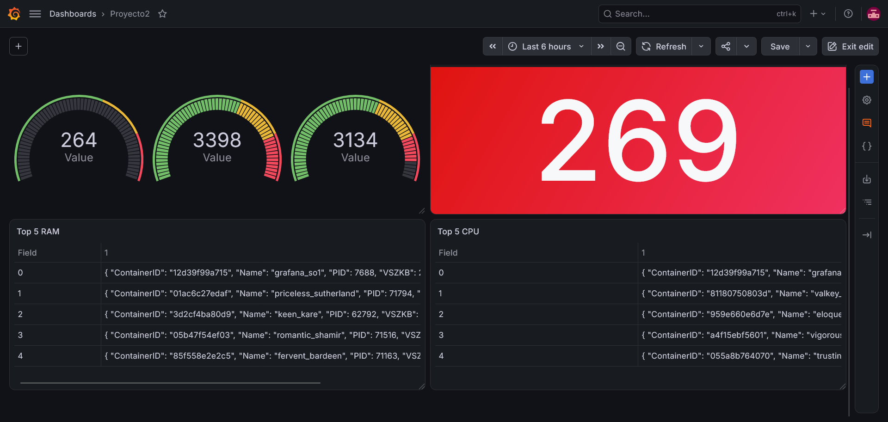

## Instalación del Daemon

El daemon se ejecuta como un binario de Go directamente en el sistema host (no dentro de un contenedor). Los pasos son:

**1. Compilar**
```bash
cd daemon/
go mod tidy
go build -o daemon_so1 main.go
```

**2. Ejecutar**
```bash
sudo ./daemon_so1
```
Se necesita `sudo` porque el daemon ejecuta `insmod` para cargar el módulo de kernel y modifica el crontab del sistema.

**3. Detener**
```bash
# Ctrl+C en la terminal, o desde otra sesión:
sudo kill -SIGTERM $(pgrep daemon_so1)
```
Al recibir la señal, el daemon elimina automáticamente el cronjob antes de cerrar.

---
**Requisitos para ejecutar:**
- Docker y Docker Compose instalados y corriendo
- Módulo de kernel compilado (`make all` dentro de `module-kernels/`)
- Go 1.21+ instalado
- Los scripts `load_module.sh` y `containers.sh` con permisos de ejecución (`chmod +x scripts/*.sh`)
---
**Monitoreo Grafana**
Una vez se haya instalado el Deamon se puede acceder a localhost:3000 para usar Grafana y ver el Dashboard

